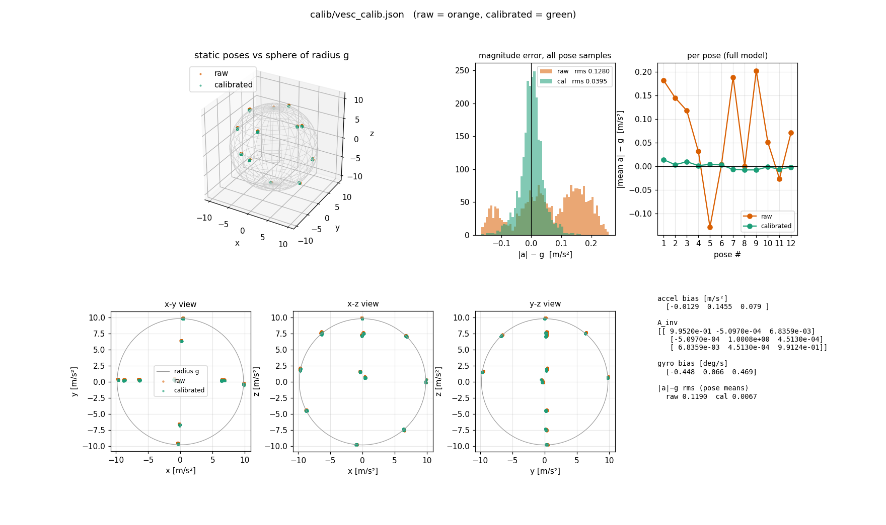

# VESC IMU calibration report

**Board:** VESC 6 MkVI, firmware 7.00 (`60_MK6`), internal BMI160 IMU
**Calibrated:** 2026-09-28. Gyro step 18:42, accel step 18:44, mount step 18:46
**Files:** `calib/vesc_calib.json` (result), `logs/20260928_184150_calib_vesc/` (raw accel poses),
`docs/vesc_calibration_plot.png` (plot below)

## Conclusion

**The calibration is good and should be used.** It removes almost all of the accelerometer's systematic
error and the gyro's drift.

| | Before | After (on the 12 fitted poses) | After (on poses it did not see*) |
|---|---|---|---|
| Accel \|a\| − g, RMS | 0.119 m/s² | 0.0067 m/s² | **0.033 m/s²** |
| Accel \|a\| − g, worst pose | 0.202 m/s² | 0.014 m/s² | 0.069 m/s² |
| Gyro bias | 0.45 °/s (z) | ≈ 0 (bias removed) | — |

\* Leave-one-out test: fit on 11 poses, check the 12th, repeat for every pose. This is the honest number
to quote. The 0.0067 figure is optimistic because it is measured on the poses the fit was made from.

**Realistic accuracy after calibration is about 0.03 m/s² (about 0.2° of tilt), roughly 3.5× better than raw.**
The gyro correction matters most in practice. Uncorrected, the z bias would turn the heading by about
**28° per minute**.

The accel error on unseen poses can still be brought down, by using more poses held more still (see
[Next calibration](#next-calibration-how-to-do-it-better)). It is not a blocker. The larger error sources
in the system right now are elsewhere:
- The mount rotation isn't in `car.yaml` yet.
- The IMU position and the wheel-speed gain are still placeholders.

---

## How to read the plot



Orange = raw sensor, green = after calibration, in every panel.

| Panel | What it shows | Good result |
|---|---|---|
| **3D sphere** (top left) | Every reading as a point. A perfect accelerometer at rest always reads exactly g (9.807 m/s²), so all points should sit on the sphere's skin. Each **clump is one pose**; the many dots in a clump are the ~200 readings/s taken while it sat still. | Clumps spread over the whole ball (many directions tested), green on the skin. |
| **x-y / x-z / y-z views** (bottom row) | The same ball flattened and viewed from the top / front / side, because 3D is hard to read. | Same as above. **Here the correction (~0.1) is too small to see against the radius (9.8)**, so orange and green overlap. That's expected, not a failure. |
| **Magnitude error histogram** (top middle) | For every single reading: how far is \|a\| from g? Bar height = how many readings had that error. | One **tall, narrow spike centered on 0**. Raw (orange) shows two humps (too high in some poses, too low in others); calibrated (green) is one spike at 0. The spike's width is noise plus slight movement during holds, which calibration cannot remove. |
| **Per pose** (top right) | One dot per pose: that pose's average error. | Green **flat on 0**. Raw zigzags up to ±0.2 because its error depends on orientation; calibrated stays within ±0.014. |
| **Numbers** (bottom right) | The fitted bias, the correction matrix `A_inv`, gyro bias, and RMS before/after. | See the analysis below. |

How the correction is applied to every sample: `acc_calibrated = A_inv · (acc_raw − bias)`,
`gyro_calibrated = gyro_raw − gyro_bias`.

---

## The 12 poses

"Gravity direction" is the unit vector the accelerometer measured, in the **sensor's own axes**. The
axis with the largest component points at the ceiling. The **car description** uses the mount step's
result (sensor +Y ≈ car forward, sensor +X ≈ car right side, +Z up). It is only as right as that
measurement.

| # | Gravity direction (x, y, z) | Tilt from level | Nearest face | Car description | Raw error | Cal. error | Accel noise σ (max axis) | Gyro σ (max axis) | Samples |
|---|---|---|---|---|---|---|---|---|---|
| 1 | (−0.011, 0.012, 1.000) | 1.0° | +Z (1° off) | level, wheels down | +0.181 | +0.014 | 0.026 | 0.09 °/s | 201 |
| 2 | (0.038, 0.997, 0.070) | 86.0° | +Y (5° off) | nose up | +0.145 | +0.003 | 0.069 | 1.04 °/s | 191 |
| 3 | (−0.978, 0.042, 0.205) | 78.1° | −X (12° off) | on its right side (left side up) | +0.118 | +0.009 | 0.097 | 0.75 °/s | 302 |
| 4 | (1.000, −0.025, −0.003) | 90.2° | +X (1° off) | on its left side (right side up) | +0.031 | +0.001 | 0.093 | 0.80 °/s | 181 |
| 5 | (−0.041, −0.985, 0.169) | 80.3° | −Y (10° off) | nose down | −0.129 | +0.004 | 0.044 | 1.31 °/s | 292 |
| 6 | (−0.091, 0.043, −0.995) | 174.2° | −Z (6° off) | upside down | +0.004 | +0.002 | 0.062 | 0.63 °/s | 134 |
| 7 | (0.011, 0.643, 0.766) | 40.0° | between +Z/+Y | nose up ~40° | +0.189 | −0.007 | 0.046 | 0.80 °/s | 99 |
| 8 | (−0.016, −0.671, 0.742) | 42.1° | between +Z/−Y | nose down ~42° | −0.000 | −0.008 | 0.056 | 1.11 °/s | 192 |
| 9 | (−0.643, 0.034, 0.765) | 40.1° | between +Z/−X | left side up ~40° | +0.202 | −0.008 | 0.070 | 0.95 °/s | 301 |
| 10 | (0.688, 0.030, 0.725) | 43.5° | between +Z/+X | right side up ~44° | +0.050 | −0.002 | 0.055 | 1.00 °/s | 202 |
| 11 | (−0.892, 0.034, −0.451) | 116.8° | between −X/−Z | left side up, rolled past vertical toward upside down | −0.027 | −0.007 | 0.064 | 1.54 °/s | 301 |
| 12 | (0.653, 0.032, −0.757) | 139.2° | between −Z/+X | upside down, right side raised ~41° | +0.071 | −0.002 | 0.087 | 0.70 °/s | 90 |

Errors are \|a\| − g of the pose average, in m/s². Noise is the standard deviation of the samples within the pose.

**Coverage:** all 6 faces are covered, plus 6 in-between poses. The closest two poses are 38° apart
(capture requires ≥ 25°). The in-between poses are all tilted about ±40° around one axis each. Nothing
tests a diagonal like "nose up **and** left side up".

---

## Analysis

**1. Accelerometer bias** = (−0.013, **+0.146**, +0.079) m/s², i.e. (−1.3, **+14.8**, +8.1) mg.
The y-axis offset dominates. Uncorrected, the total bias (0.17 m/s²) looks like a **~1° tilt**. Offsets
of this size are normal for a consumer MEMS accelerometer.

**2. Scale and cross-axis errors** are small:
- Scale errors are +0.5 % (x), −0.1 % (y), +0.9 % (z). A 1 g reading on z comes out about 0.09 m/s² too high.
- The largest cross-axis term is 0.7 %, between x and z: the axes are very slightly non-perpendicular.

**3. The full model is justified.** Leave-one-out error for each model:

| Model | Parameters | Error on unseen poses (RMS) |
|---|---|---|
| none | 0 | 0.119 m/s² |
| bias only | 3 | 0.091 m/s² |
| bias + per-axis scale | 6 | 0.065 m/s² |
| **full: bias + scale + cross-axis (used)** | 9 | **0.033 m/s²** |

Each step helps on data the fit never saw, so the cross-axis terms reflect the real sensor, not noise.

**4. Where the remaining error comes from:**
- **The fit is thinly supported.** 12 poses for 9 unknowns is enough, but just barely. The worst
  held-out errors are poses 2 and 5 (nose up/down, 0.069 and 0.061). The y-axis scale depends mostly on
  those two poses, so leaving one out hurts.
- **Poses were not perfectly still.** Pose 1 (level, the quietest) shows roughly the sensor's true noise:
  ~0.02 m/s² and 0.09 °/s. Most other poses show 2–5× more accel spread and 0.6–1.5 °/s of gyro motion.
  They were held or settled on something that moved slightly (pose 11 is the least still). This is also
  why the histogram's green spike is wider (0.04) than the pure sensor noise (0.02).

**5. Gyro:**
- **Bias** = (−0.45, +0.07, +0.47) °/s, measured over 1507 still samples.
- **Noise** ≈ 0.09–0.10 °/s per axis.
- **Drift if left uncorrected:** about **28° of heading per minute**, from the z bias.
- **This bias changes with temperature**, so re-measure it each session (10 s, see below).

**6. Mount (sensor → car rotation):** roll −0.35°, pitch −0.07°, **yaw −84.7°**. The VESC is mounted about
90° turned in the car and is almost perfectly level. **Not yet applied:** copy it into `config/car.yaml`:
```yaml
imus:
  vesc:
    rpy_deg: [-0.35, -0.07, -84.69]
```

---

## Commands

Run from `~/sfu_racerbot/vsec_testing`. **Close VESC Tool first** (only one program can use the port).
In VESC Tool, **App Settings → IMU**: accel and gyro offsets must be **0**, and rotation settings must stay as they
were when calibrating.

### Calibrate
```bash
# full IMU calibration: 10 s still (gyro) + 12 poses (accel) -> calib/vesc_calib.json
python3 tools/calibrate_imu.py --imu vesc --vesc /dev/ttyACM0

# only the gyro bias (quick; do this at the start of each session)
python3 tools/calibrate_imu.py --imu vesc --vesc /dev/ttyACM0 --step gyro

# only the accelerometer, with more poses and longer holds
python3 tools/calibrate_imu.py --imu vesc --vesc /dev/ttyACM0 --step accel --poses 18 --hold 2.5

# mount rotation: car on level ground, still ~3 s, then push straight forward
python3 tools/calibrate_imu.py --imu vesc --vesc /dev/ttyACM0 --step mount
```
Steps that aren't re-run keep their previous values in the calibration file.

### Check and plot
```bash
python3 tools/plot_calibration.py calib/vesc_calib.json                  # the plot above (window)
python3 tools/plot_calibration.py calib/vesc_calib.json --save out.png   # save as image
python3 tools/calib_live.py --vesc /dev/ttyACM0                          # live raw vs calibrated sphere
python3 tools/imu_monitor.py --vesc /dev/ttyACM0                         # live numbers, "raw" and "cal" lines
python3 tools/imu_filter_plot.py --rate 200 --accel-hz <X> --gyro-hz <Y> # VESC low-pass filter pole-zero
```

### When to recalibrate
- **Gyro only:** every session, or when `imu_monitor` shows the calibrated gyro reading > 0.1 °/s at rest.
- **Full calibration:**
  - after changing the IMU rotation or offsets in VESC Tool
  - after reflashing firmware
  - after a hard crash
  - if new poses in `imu_monitor` show calibrated \|a\| − g beyond ±0.05 m/s²
- **Mount step:** whenever the VESC is moved or re-mounted in the car.

## Next calibration: how to do it better
1. **Rest, don't hold.** Set it down or prop it against something, and let go until `captured` prints.
   Pose 1 (level, the quietest) was 3–5× quieter than the others.
2. **18–24 poses instead of 12** (`--poses 18`). More than enough for 9 unknowns, so no single pose
   dominates. Add diagonal poses (nose up **and** a side up), and more near nose up/down, which were the
   weakest.
3. **Longer holds** (`--hold 2.5`) average out more noise per pose.
4. Compare the new bias with this report's. If it's within ~0.02 m/s², the sensor is stable and this
   calibration can be trusted long term.
